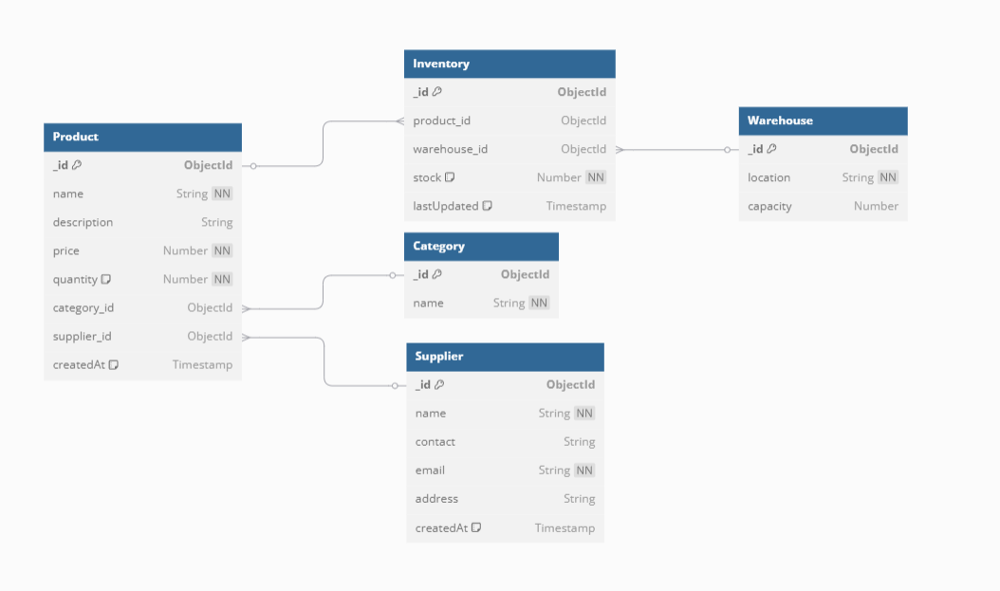

# ProductInventoryPostman


## Integration of POSTMAN

### Initialize Project:
```sh
mkdir product-inventory-api
cd product-inventory-api
npm init -y
```

### Install Required Dependencies:
```sh
npm install express mongoose dotenv bcryptjs jsonwebtoken cors morgan stripe
```

### Explanation of Packages:
- **express** → Framework for building the API
- **mongoose** → MongoDB ORM for defining schemas
- **dotenv** → Loads environment variables from a `.env` file
- **bcryptjs** → For hashing passwords securely
- **jsonwebtoken** → For authentication with JWT
- **cors** → To allow cross-origin requests
- **morgan** → Logger for monitoring API requests

### For Development:
```sh
npm install --save-dev nodemon
```

### Open Connection:
```sh
nodemon index.js
```

### Project Directory Structure:
```
product-inventory-api/
│-- config/
│   ├── database.js       # MongoDB connection
│-- models/
│   ├── Product.js        # Mongoose schema for products
    |---Inventory.js
    |--- Category.js
    |---Supplier.js
    |---Warehouse.js
│-- routes/
│   ├── productRoutes.js  # Product API endpoints
    |--- inventoryRoutes.js
    |--- supplierRoutes.js
    |--- warehouseRoutes.js
    |---categoryRoutes.js
│-- controllers/
│   ├── productController.js # CRUD logic for products
    |---inventoryController.js
    |---warehouseCntroller.js
    |---categoryController.js
    |---supplierController.js
│-- .env                   # Environment variables
│-- index.js               # Entry point
|-- requirements.txt
|--testing/              # Syntax to TEST on POSTAMN
    |-- GET.md
    |-- POST.md
    |-- SystemManipulation.md
│-- package.json
```

### To Clone:
```sh
git clone https://github.com/chrisjallaine/ProductInventoryPostman.git
```
